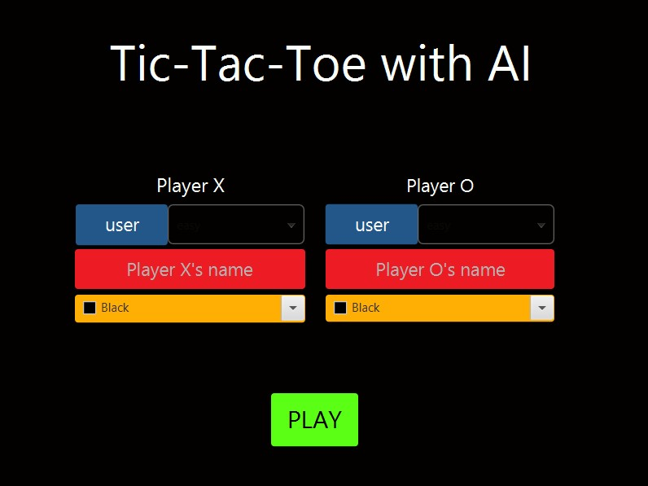
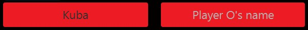
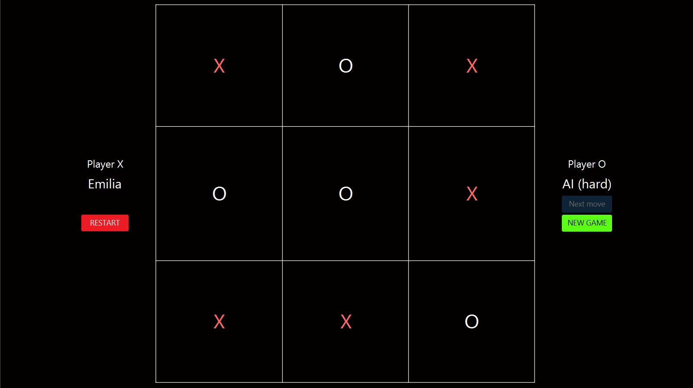
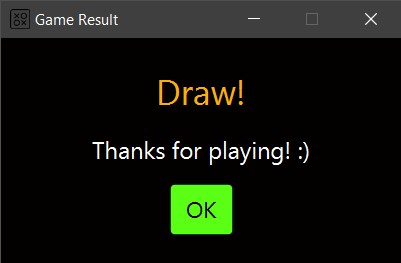

# TicTacToe with AI

## Context

In the late summer of 2021 I had some spare time, so I come up with an idea to code something for fun. I decided to
implement one of my favorite childhood paper games - tic-tac-toe. To make my game more engaging game
features [MinMax algorithm](https://en.wikipedia.org/wiki/Minimax) and move anticipation. Image bellow depicts main menu of my application.

## Setting up the game

### Difficulty level of artificial opponent

User can choose to play personally by clicking `user` button or choose the difficulty level of the computer. The game
features 3 difficulty levels:

- `easy` - moves are made randomly
- `medium` - if there is an opportunity to win or stop opponent from winning, appropriate move is made, otherwise the
  move is made randomly
- `hard` - the moves are made according to the minmax algorithm

### Names of the users

If the user decides to play itself, a red textfield appears on the screen. Field can be filled with a name or left
empty.

### Colors of the X and O symbols

Users can optionally change color of their symbols. The default one is `white`.

## Gameplay

If player is playing personally, the only thing to make a move is to click on the desired field of the board. To invoke
move made by computer `Next move` button needs to be clicked. After the game is finished user can return to main menu by
clicking `NEW GAME` button or play again with the same configuration by clicking `RESTART` button.

Image above presents sample capture of the gameplay. As we can see `Emilia` drew with computer playing on hard
difficulty level. Image bellow presents the sample window informing about the result of the game.

## Technologies 
- Java 14
- JavaFX 14
- FXML
- CSS

## Sources
The `icon.png` file can be found [here](https://cdn0.iconfinder.com/data/icons/web-ui-vol-4/64/tic_tac_toe-512.png).

